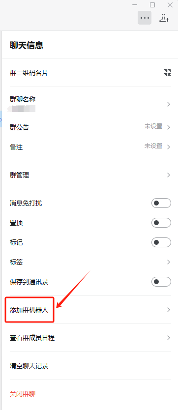
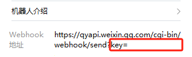

## Python使用微信机器人发送消息
微信群机器人官方文档：https://developer.work.weixin.qq.com/document/path/91770

### 如何创建微信机器人并获取Key


> 其中"key="后面的xxxxxx，就是该微信机器人对应的key

### 如何下载安装&更新
```
pip install PyWeChatBot
# pip install --upgrade PyWeChatBot

# 如果遇到安装报错,一般可以通过更新pip后重新执行解决
# python -m pip install --upgrade pip
```

### 如何使用微信机器人发送消息
#### 1.创建微信机器人
```pyhton
from wechatbot.wechat_bot import WeChatBot
# 输入根据上面方式所创建的机器人对应的Key
wx_key = "xxx"
# 初始化微信机器人
wx = WeChatBot(wx_key)
```

#### 2.发送文本类型的消息
```
wx.send_text("准备吃午饭啦~~~")
```

#### 3.发送markdown类型的消息
```
wx.send_markdown("""实时新增用户反馈<font color=\"warning\">132例</font>，请相关同事注意。\n
         >类型:<font color=\"comment\">用户反馈</font>
         >普通用户反馈:<font color=\"comment\">117例</font>
         >VIP用户反馈:<font color=\"comment\">15例</font>""")
```

#### 4.发送图片类型的消息
```
wx.send_image(r"./my_pic.png")
wx.send_image("http://res.mail.qq.com/node/ww/wwopenmng/images/independent/doc/test_pic_msg1.png")
```

#### 5.发送图文类型的消息
```
wx.send_news(title="该摸鱼了", url="zhihu.com", picurl="https://img0.baidu.com/it/u=490071974,3856819170&fm=253&fmt=auto&app=120&f=JPEG?w=608&h=304",
             description="是时候休息一下了")
```


#### 6.上传并发送文件
```
resp = wx.upload_media_file('file', r'./test.txt')
wx.send_file(resp['media_id'])
```